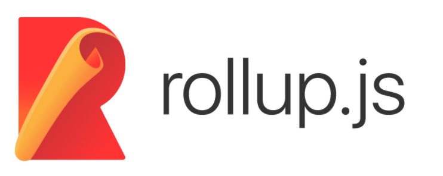
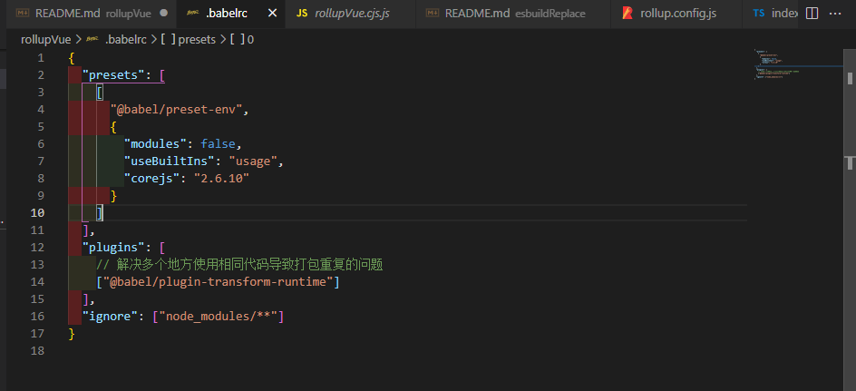
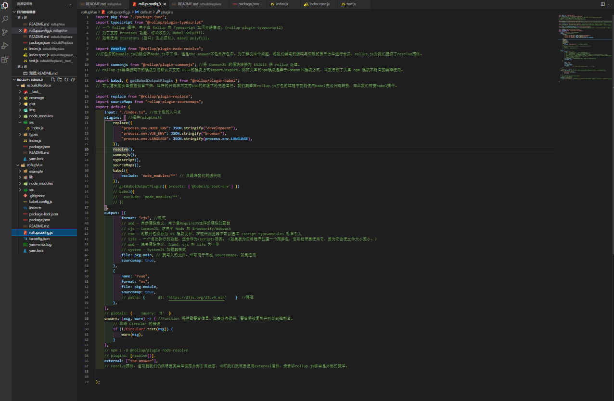

## 一：含义：<a href="https://www.rollupjs.com/" target="_blank">Rollup</a> 是一个 JavaScript 模块打包器，可以将小块代码编译成大块复杂的代码，例如 library 或应用程序。<a href="https://rollupjs.org/guide/en/" target="_blank">rollupjs.org</a>



## 二：Rollup 原理

---

### 1：`Rollup 前置知识`

> 1.1：rollup 使用了 acorn 和 magic-string 两个库

> 1.2：acorn 是一个 JavaScript 语法解析器，它将 JavaScript 字符串解析成语法抽象树 AST。(操作这颗树 我们可以精准的定位到声明的语句 赋值的语句 运算语句 实现对代码的分析，优化，变更等操作。)<a href="https://astexplorer.net/" target="_blank">了解 AST 语法树可以点击这个网址 astexplorer.net/</a>

> 1.3：magic-string 也是 rollup 作者写的一个关于字符串操作的库

源码结构：<a href="https://github.com/rollup/rollup" target="_blank">点击 github 地址</a>

```
│  bundle.js // Bundle 打包器，在打包过程中会生成一个 bundle 实例，用于收集其他模块的代码，最后再将收集的代码打包到一起。
│  external-module.js // ExternalModule 外部模块，例如引入了 'path' 模块，就会生成一个 ExternalModule 实例。
│  module.js // Module 模块，开发者自己写的代码文件，都是 module 实例。例如有 'foo.js' 文件，它就对应了一个 module 实例。
│  rollup.js // rollup 函数，一切的开始，调用它进行打包。
│
├─ast // ast 目录，包含了和 AST 相关的类和函数
│      analyse.js // 主要用于分析 AST 节点的作用域和依赖项。
│      Scope.js // 在分析 AST 节点时为每一个节点生成对应的 Scope 实例，主要是记录每个 AST 节点对应的作用域。
│      walk.js // walk 就是递归调用 AST 节点进行分析。
│
├─finalisers
│      cjs.js // 打包模式，目前只支持将代码打包成 common.js 格式
│      index.js
│
└─utils // 一些帮助函数
        map-helpers.js
        object.js
        promise.js
        replaceIdentifiers.js
```

### 2: `rollup.rollup()`

主要步骤：
配置收集、标准化-->
文件分析-->
源码编译，生成 ast-->
模块生成-->
依赖解析-->
过滤净化-->
产出 chunks

### 3: `rollup.generate + rollup.write`

主要步骤：
配置标准化、创建插件驱动器-->
chunks、assets 收集-->
preserveModules 模式处理-->
预渲染-->
chunk 优化-->
源码 render-->
产出过滤、排序

### 4: `rollup.watch`

主要步骤：
主类: Watcher，获取用户传递的配置，然后创建 task 实例-->Task，任务类，用来执行 rollup 构建任务

### 5:`tree shaking`

tree-shaking 可以理解为通过工具"摇"我们的 JS 文件，将其中用不到的代码"摇"掉，属于性能优化的范畴。 tree-shaking 的本质是借助 ES module 的静态分析来消除无用的 js 代码（1. 代码不会被执行到 2. 代码执行的结果不会被用到 3. 代码只影响死变量）

### 6:`plugins`

rollup 的 plugin 既可以担任 loader 的角色，也可以胜任传统 plugin 的角色。rollup 提供的钩子函数是核心，比如 load、transform 对 chunk 进行解析更改，resolveFileUrl 可以对加载模块进行合法解析，options 对配置进行动态更新等等

<font color=#f04747>原理总结：读取并合并配置 -> 创建依赖图 -> 读取入口模块内容 -> 借用开源 estree 规范解析器进行源码分析，获取依赖，递归此操作 -> 生成模块，挂载模块对应文件相关信息 -> 分析 ast，构建各 node 实例 -> 生成 chunks -> 调用各 node 重写的 render -> 利用 magic-string 进行字符串拼接和 wrap 操作 -> 写入</font>

## 三：打包过程

---

> - 1.1 rollup 读取 main.js 入口文件 rollup() 首先生成一个 Bundle 实例，也就是打包器。然后根据入口文件路径去读取文件，最后根据文件内容生成一个 Module 实例。

```
fs.readFile(path, 'utf-8', (err, code) => {
    if (err) reject(err)
    const module = new Module({
        code,
        path,
        bundle: this, // bundle 实例
    })
})
```

> - 1.2 new Moudle() 过程 在 new 一个 Module 实例时，会调用 acorn 库的 parse() 方法将代码解析成 AST ,接下来需要对生成的 AST 进行分析。

```
this.ast = parse(code, {
    ecmaVersion: 6, // 要解析的 JavaScript 的 ECMA 版本，这里按 ES6 解析
    sourceType: 'module', // sourceType值为 module 和 script。module 模式，可以使用 import/export 语法
})
```

> - 1.3 分析导入和导出的模块，将引入的模块和导出的模块填入对应的对象 分析每个 AST 节点间的作用域，找出每个 AST 节点定义的变量。每遍历到一个 AST 节点，都会为它生成一个 Scope 实例。

> - 1.4 分析标识符(什么是标识符？如变量名，函数名，属性名，都归为标识符)，并找出它们的依赖项

> - 1.5 根据依赖项，读取对应的文件 找到它对应的文件。然后读取这个文件生成一个新的 Module 实例。

> - 1.6 已经引入了所有的函数。这时需要调用 Bundle 的 generate() 方法生成代码 然后移除额外代码

> - 1.7 生成最终代码，写入目标文件

## 四：快速上手

> 4.1 全局安装 rollup

```
npm i rollup -g

```

> 4.2 使用配置文件(rollup.config.js)

```
import resolve from "@rollup/plugin-node-resolve";

export default {
    input: './src/main.js', //入口文件
    output: [{
            format: "cjs", //格式
            // amd – 异步模块定义，用于像RequireJS这样的模块加载器
            // cjs – CommonJS，适用于 Node 和 Browserify/Webpack
            // esm – 将软件包保存为 ES 模块文件，在现代浏览器中可以通过 <script type=module> 标签引入
            // iife – 一个自动执行的功能，适合作为<script>标签。（如果要为应用程序创建一个捆绑包，您可能想要使用它，因为它会使文件大小变小。）
            // umd – 通用模块定义，以amd，cjs 和 iife 为一体
            // system - SystemJS 加载器格式
            file: pkg.main, // 要写入的文件。也可用于生成 sourcemaps
            sourcemap: true, //如果 true，将创建一个单独的sourcemap文件。如果 inline，sourcemap将作为数据URI附加到生成的output文件中。
        },
        {
            file: './dist/bundle.js', //打包后的存放文件
            format: 'cjs', //输出格式 amd es6 iife umd cjs
            name: 'bundleName' //如果iife,umd需要指定一个全局变量
        },
    ],
    plugins: [ //插件
        resolve(),
    ],
    external: [
        'some-externally-required-library', //外部依赖的名称
        path.resolve('./src/some-local-file-that-should-not-be-bundled.js') //一个已被找到路径的ID（像文件的绝对路径）
    ],
    globals: {
        jquery: '$' //告诉 Rollup jquery 模块的id等同于 $ 变量:
    },
    watch: {
        include: 'src/**', //限制文件监控至某些文件
        exclude: 'node_modules/**' //防止文件被监控
    }
}

```

## 五：深入使用<a href="https://rollupjs.org/guide/en/#error-javascript-heap-out-of-memory" target="_blank">(点击查看)</a>

> - 1：使用 Babel

## why？

<font color=#538cf5>explain: 为了正确解析我们的模块并使其与旧版浏览器兼容</font>

```
cnpm install rollup-plugin-babel --save-dev
```

> - 2：添加 Babel 配置文件.babelrc



> - 3：安装@babel/core 和 @babel/preset-env
>   ( @babel/core 是 babel 核心库 @babel/preset-env 提供预设 ES2015+转 es5)

```
cnpm install @babel/core @babel/preset-env --save-dev
```

> - 4：node 模块的引用

## why？

<font color=#538cf5>explain: 与 webpack 和 browserify 这样的其他捆绑包不同，rollup 不知道如何打破常规去处理这些依赖。因此我们需要添加一些配置查找外部模块，然后导入加载 npm 模块</font>

#### rollup.js 编译源码中的模块引用默认只支持 ES6+的模块方式 import/export。然而大量的 npm 模块是基于 CommonJS 模块方式，这就导致了大量 npm 模块不能直接编译使用。所以辅助 rollup.js 编译支持 npm 模块和 CommonJS 模块方式的插件就应运而生。

```
cnpm install @rollup/plugin-node-resolve @rollup/plugin-commonjs --save-dev
```

> - 5：使用 typescript(增强代码的可维护性)

```
cnpm install @rollup/plugin-typescript --save-dev
```

> - 6：编译 css

如果你的 js 类库里还是必不可少要写些 css 的话，rollup 也是有插件编译 css 的。
('rollup-plugin-postcss':Rollup 和 PostCSS 之间的无缝集成)
(Rollup Sass files: 'rollup-plugin-sass')

<font color=#538cf5>extend: 不支持 less imports 的解决方案'rollup-plugin-postcss-webpack-alias-less-loader'</font>

```
cnpm install rollup-plugin-postcss --save-dev

import postcss from 'rollup-plugin-postcss'

 plugins: [
       postcss()
    ]
```

> - 7：区分开发环境和生产环境

可以将 rollup.config.js 拆分成两个 rollup.config.dev.js 和 rollup.config.build.js

## 六：本项目搭建

> 1: npm init

> 2: 创建 rollup.config.js
> 

> 3:定义入口文件(input)和打包输入的目录和文件(output) 导入插件

> 4: 编写项目代码

> 5: 创建 example 使用 rollup 打包出来的模块
